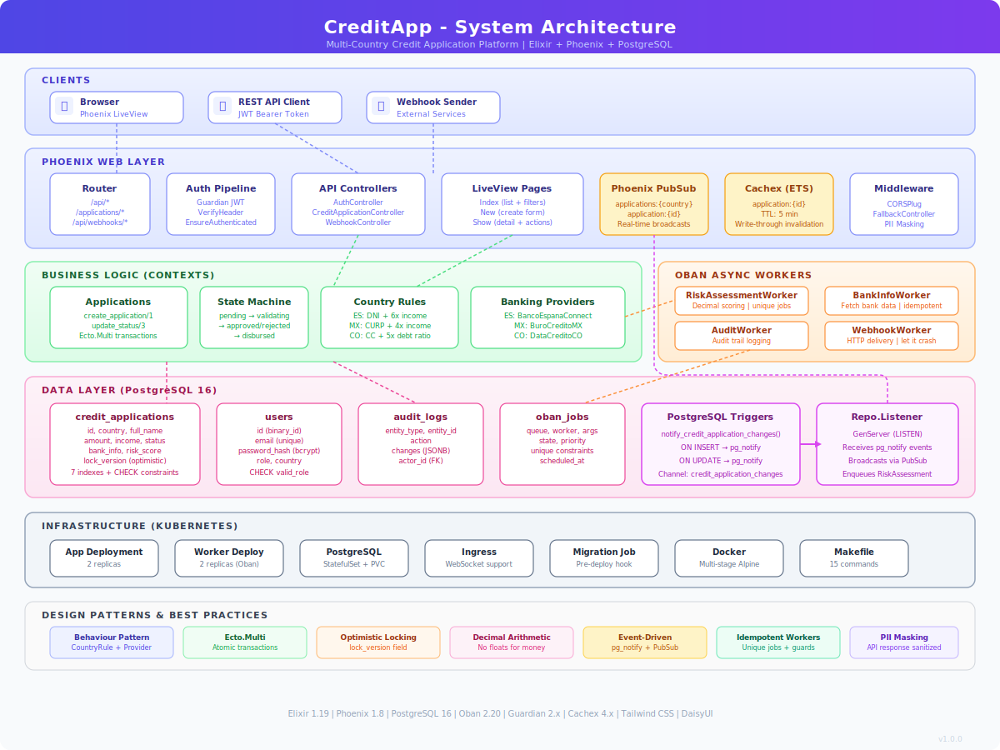
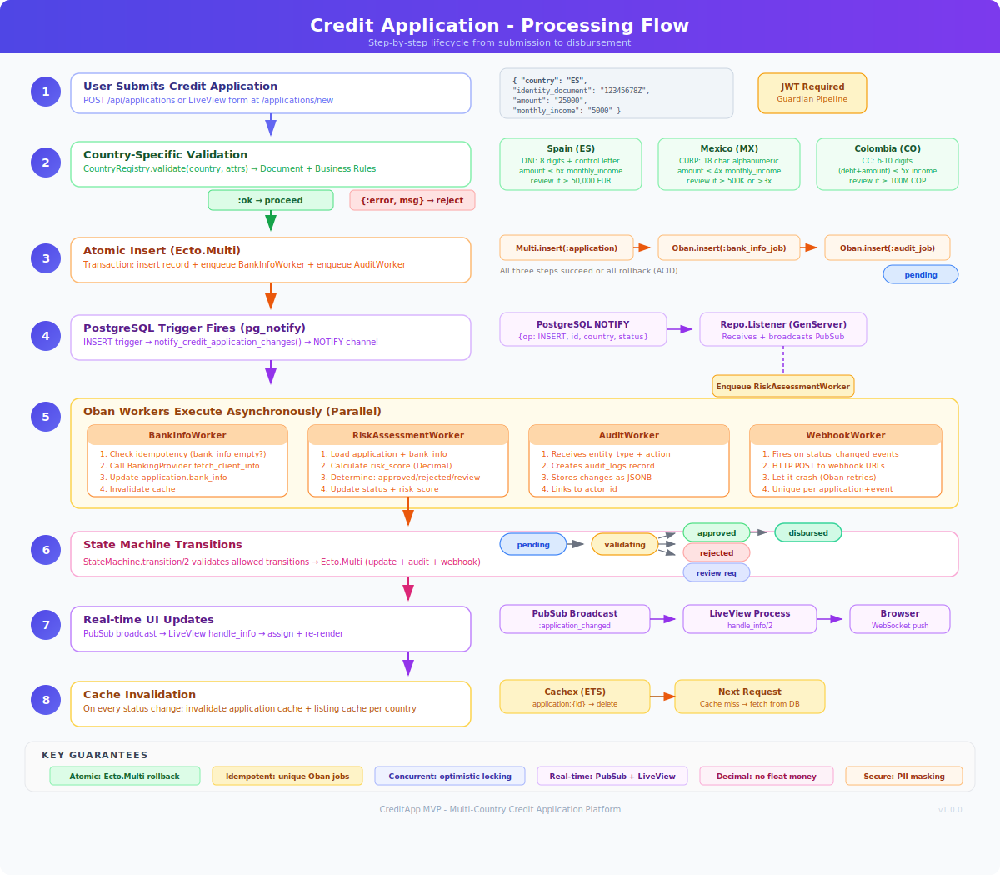

# CreditApp - Multi-Country Credit Application System

Sistema de solicitudes de crédito multipaís construido con Elixir/Phoenix, diseñado para operar a gran escala en múltiples países con reglas de negocio, proveedores bancarios y flujos de estados independientes por país.

## Diagramas de Arquitectura

### Arquitectura del Sistema


### Flujo de Procesamiento


## Stack Tecnológico

| Componente | Tecnología | Justificación |
|---|---|---|
| Backend | **Elixir 1.17 + Phoenix 1.8** | Concurrencia masiva nativa (BEAM), fault tolerance, hot code reload |
| Base de datos | **PostgreSQL 16** | Triggers, pg_notify, JSONB, particionamiento nativo |
| Job Queue | **Oban 2.20** | Cola basada en PostgreSQL, sin infraestructura adicional, reintentos, scheduling |
| Cache | **Cachex 4.x** (ETS-backed) | Cache en memoria distribuida, TTL automático, sin Redis necesario |
| Real-time | **Phoenix LiveView + Channels** | WebSocket nativo, sin librerías JS adicionales |
| Auth | **Guardian 2.x (JWT)** | Estándar en el ecosistema Elixir |
| Frontend | **Phoenix LiveView + Tailwind CSS** | UI reactiva server-side, actualizaciones en tiempo real built-in |

## Inicio Rápido (< 5 min)

### Prerrequisitos
- Elixir >= 1.15
- Docker (para PostgreSQL)

### Instalación

```bash
# 1. Clonar el repositorio
git clone <repo-url> && cd credit_app

# 2. Levantar PostgreSQL
docker run -d --name credit_app_pg -p 5432:5432 \
  -e POSTGRES_USER=postgres -e POSTGRES_PASSWORD=postgres \
  -e POSTGRES_DB=credit_app_dev postgres:16-alpine

# 3. Setup completo (deps + DB + migrations + seeds)
make setup

# 4. Iniciar el servidor
make run
```

Visitar [http://localhost:4000](http://localhost:4000) para el frontend LiveView.

### Usuarios de prueba (seeds)

| Email | Password | Rol | País |
|---|---|---|---|
| admin@creditapp.com | admin123456 | admin | - |
| analyst_es@creditapp.com | analyst123456 | analyst | ES |
| analyst_mx@creditapp.com | analyst123456 | analyst | MX |
| analyst_co@creditapp.com | analyst123456 | analyst | CO |

### API Auth

```bash
# Login (obtener JWT token)
curl -X POST http://localhost:4000/api/auth/login \
  -H "Content-Type: application/json" \
  -d '{"email": "admin@creditapp.com", "password": "admin123456"}'

# Usar token en requests protegidos
curl http://localhost:4000/api/applications \
  -H "Authorization: Bearer <token>"
```

## Países Implementados

| País | Código | Documento | Proveedor Bancario | Reglas |
|---|---|---|---|---|
| España | ES | DNI (8 dígitos + letra control) | BancoEspañaConnect | Monto max 6x ingreso, revisión si > 50K EUR |
| México | MX | CURP (18 caracteres) | BuroCreditoMX | Monto max 4x ingreso, revisión si > 500K MXN |
| Colombia | CO | CC (6-10 dígitos) | DataCreditoCO | Deuda total + monto < 5x ingreso |

### Extensibilidad

Para agregar un nuevo país:
1. Crear módulo en `lib/credit_app/countries/<code>.ex` implementando `CountryRule` behaviour
2. Crear proveedor en `lib/credit_app/banking_providers/<code>_provider.ex` implementando `Provider` behaviour
3. Registrar en `countries/registry.ex` y `banking_providers/registry.ex`

**No se requiere modificar ningún otro archivo.** El patrón Strategy via behaviours de Elixir garantiza extensibilidad sin cambios disruptivos.

## Modelo de Datos

### credit_applications
```
id              UUID (PK)
country         VARCHAR     -- ES, MX, CO
full_name       VARCHAR     -- Nombre completo
identity_document VARCHAR   -- DNI/CURP/CC según país
amount          DECIMAL     -- Monto solicitado
monthly_income  DECIMAL     -- Ingreso mensual
application_date DATE       -- Fecha de solicitud
status          VARCHAR     -- pending, validating, approved, rejected, review_required, cancelled, disbursed
bank_info       JSONB       -- Info del proveedor bancario (estructura variable por país)
risk_score      DECIMAL     -- Score de riesgo calculado (0.0 - 1.0)
notes           TEXT        -- Notas/observaciones
metadata        JSONB       -- Datos adicionales extensibles
user_id         UUID (FK)   -- Usuario que creó la solicitud
```

### audit_logs
```
id          UUID (PK)
entity_type VARCHAR     -- Tipo de entidad auditada
entity_id   UUID        -- ID de la entidad
action      VARCHAR     -- created, status_changed, etc.
changes     JSONB       -- Cambios realizados
actor_id    UUID        -- Quién hizo el cambio
metadata    JSONB       -- Contexto adicional
```

### users
```
id            UUID (PK)
email         VARCHAR (unique)
password_hash VARCHAR
role          VARCHAR     -- admin, analyst, viewer
country       VARCHAR     -- País asignado (nullable)
```

## Máquina de Estados

```
pending → validating → approved → disbursed
    ↓         ↓            ↓
 cancelled  rejected    cancelled
    ↓         ↑
         review_required → validating | approved | rejected | cancelled
```

Cada transición dispara:
- **Audit log** (via Oban worker asíncrono)
- **Webhook notification** (via Oban worker asíncrono)
- **PubSub broadcast** (actualización en tiempo real en LiveView)

## Decisiones Técnicas

### 1. Procesamiento Asíncrono: Oban (PostgreSQL-backed)
- **Por qué Oban y no RabbitMQ/Redis:** Oban usa PostgreSQL como backend de cola, eliminando la necesidad de infraestructura adicional. En un MVP esto reduce complejidad operativa sin sacrificar funcionalidad (reintentos, scheduling, prioridades, rate limiting).
- **Colas configuradas:** `risk_assessment` (5 workers), `banking` (5), `webhooks` (5), `audit` (5), `default` (10)
- **Workers:** `RiskAssessmentWorker`, `BankInfoWorker`, `AuditWorker`, `WebhookWorker`

### 2. PostgreSQL Triggers + pg_notify
- Al insertar/actualizar una solicitud, un trigger de PostgreSQL ejecuta `pg_notify('credit_application_changes', payload)`
- `CreditApp.Repo.Listener` (GenServer) escucha este canal y:
  - Broadcast via PubSub (actualiza LiveView en tiempo real)
  - Encola job de risk assessment (INSERT)
- **Esto cumple el requisito:** "operación en BD genera trabajo asíncrono"

### 3. Phoenix LiveView para Real-time
- **Por qué LiveView y no React + Socket.IO:** LiveView permite actualizaciones en tiempo real sin escribir JavaScript. El servidor mantiene el estado y envía diffs HTML via WebSocket. Esto reduce la complejidad del frontend a ~0 JS custom.
- Las vistas se suscriben a PubSub topics y se re-renderizan automáticamente.

### 4. Behaviours como patrón Strategy
- `CountryRule` behaviour: define la interfaz para validación de documentos y reglas de negocio por país
- `Provider` behaviour: define la interfaz de integración con proveedores bancarios
- Agregar un país = implementar estos behaviours + registrar en el registry

### 5. JSONB para bank_info
- Cada proveedor bancario retorna datos con estructura diferente (score_bc vs credit_score, IBAN vs CLABE)
- JSONB permite almacenar estas variaciones sin migraciones adicionales por proveedor

## Seguridad

### PII (Personally Identifiable Information)
- **Documentos de identidad** se enmascaran en las respuestas API (`1234****`)
- **Datos bancarios sensibles** (IBAN, CLABE, cuentas) se filtran de las respuestas API
- Los proveedores bancarios simulados también enmascaran documentos en logs

### Autenticación y Autorización
- **JWT via Guardian:** Token Bearer en header `Authorization`
- **Roles:** `admin`, `analyst`, `viewer`
- Endpoints públicos: `/api/auth/login`, `/api/auth/register`, `/api/webhooks/receive`
- Endpoints protegidos: `/api/applications/*`, `/api/auth/me`

### Webhooks
- Endpoint público `/api/webhooks/receive` para recibir notificaciones externas
- En producción, agregar verificación HMAC del payload

## Análisis de Escalabilidad

### Índices Recomendados (ya implementados)
```sql
-- Consulta principal: listar por país
CREATE INDEX idx_credit_applications_country ON credit_applications(country);
-- Filtro combinado
CREATE INDEX idx_credit_applications_country_status ON credit_applications(country, status);
-- Consultas por fecha
CREATE INDEX idx_credit_applications_country_date ON credit_applications(country, application_date);
-- Búsqueda por documento
CREATE INDEX idx_credit_applications_doc_country ON credit_applications(identity_document, country);
-- Ordenamiento
CREATE INDEX idx_credit_applications_inserted_at ON credit_applications(inserted_at);
```

### Particionamiento para Millones de Registros
Para > 10M registros, recomiendo **particionamiento por país** (list partitioning):

```sql
-- Convertir a tabla particionada
CREATE TABLE credit_applications (...) PARTITION BY LIST (country);
CREATE TABLE credit_applications_es PARTITION OF credit_applications FOR VALUES IN ('ES');
CREATE TABLE credit_applications_mx PARTITION OF credit_applications FOR VALUES IN ('MX');
CREATE TABLE credit_applications_co PARTITION OF credit_applications FOR VALUES IN ('CO');
```

**Ventajas:**
- Queries filtradas por país solo escanean la partición relevante
- Mantenimiento (VACUUM, reindex) por partición
- Archivado por país/fecha independiente

### Consultas Críticas y Optimización
1. **Listado por país + estado:** Índice compuesto `(country, status)` - O(log n)
2. **Búsqueda por ID:** Primary key UUID - O(1)
3. **Listado paginado:** Cursor-based pagination con `inserted_at` + `id` (evita OFFSET)
4. **Conteos:** Materialized views para dashboards (refresh periódico vs count real-time)

### Archivado
- Solicitudes en estados terminales (`disbursed`, `cancelled`, `rejected` > 1 año) → tabla `credit_applications_archive`
- Job de Oban programado para mover registros antiguos
- Mantener solo últimos 12 meses en tabla principal

### Escala Horizontal
- **Web nodes:** Stateless (JWT), escalan con replicas en K8s
- **Worker nodes:** Oban con `peer: Oban.Peers.Postgres` garantiza que cada job se ejecute una sola vez sin importar cuántas instancias haya
- **DB:** Read replicas para queries de listado, primary para writes

## Colas y Encolamiento (Oban)

**Tecnología:** [Oban](https://hexdocs.pm/oban) - Cola de trabajos basada en PostgreSQL.

### Producción de trabajos
```elixir
# Al crear una solicitud, se encolan:
%{id: app.id, country: country, document: doc}
|> CreditApp.Workers.BankInfoWorker.new()
|> Oban.insert()
```

### Consumo de trabajos
Oban levanta workers (GenServer processes) que pollan la tabla `oban_jobs`. Cada worker implementa `perform/1`:

```elixir
defmodule CreditApp.Workers.BankInfoWorker do
  use Oban.Worker, queue: :banking, max_attempts: 3

  def perform(%Oban.Job{args: %{"id" => id, "country" => country, "document" => doc}}) do
    # Fetch bank info, update application, trigger next step
  end
end
```

### Flujo completo:
1. **Creación** → encola `BankInfoWorker` + `AuditWorker`
2. **BankInfoWorker** completa → actualiza banco info → transiciona a `validating`
3. **PostgreSQL trigger** en UPDATE → `pg_notify` → `Repo.Listener` → encola `RiskAssessmentWorker`
4. **RiskAssessmentWorker** → calcula score → transiciona a `approved`/`rejected`/`review_required`
5. **Cambio de estado** → encola `WebhookWorker` + `AuditWorker`

## Caching

### Qué se cachea
- **Lectura individual de solicitudes** (`application:<id>`) - TTL: 5 min
- **Razón:** Las solicitudes se leen frecuentemente en la vista de detalle

### Estrategia de Invalidación
- **Write-through:** Al crear, actualizar estado, o actualizar bank_info, se invalida:
  - La key de la solicitud específica (`application:<id>`)
  - Las keys de listado por país (`applications:<country>`)
- **TTL:** 5 minutos como safety net

### Implementación
```elixir
# Lectura con cache
def get_application(id) do
  Cache.fetch("application:#{id}", :timer.minutes(5), fn ->
    Repo.get(CreditApplication, id)
  end)
end

# Invalidación en write
def update_status(id, new_status, opts) do
  # ... update ...
  Cache.invalidate_application(id)
  Cache.invalidate_listing(updated.country)
end
```

## Webhooks

### Recepción (inbound)
- `POST /api/webhooks/receive` acepta eventos externos
- Eventos soportados: `external_approval`, `bank_verification_complete`
- Ejemplo: sistema externo aprueba/rechaza una solicitud

### Envío (outbound)
- `WebhookWorker` envía POST a endpoint configurable (`WEBHOOK_URL` env var)
- Se dispara en cada cambio de estado
- Reintentos automáticos (hasta 5 intentos via Oban)

## Concurrencia

### Diseño para Procesamiento Paralelo
- **Oban workers:** Cada cola tiene múltiples workers concurrentes (ej: 5 workers de `risk_assessment`)
- **Repo.Listener:** GenServer que escucha pg_notify, procesa en paralelo via PubSub
- **BEAM/OTP:** Cada conexión WebSocket (LiveView) es un proceso aislado - miles de conexiones concurrentes

### Consistencia
- **Oban unique jobs:** Previene duplicación de jobs
- **Database constraints:** Validaciones a nivel de BD (not null, check constraints)
- **State machine:** Transiciones de estado validadas antes de UPDATE
- **Optimistic locking:** Posible agregar via campo `lock_version` en Ecto

### Escalar workers
```yaml
# k8s/worker.yaml - simplemente escalar replicas
spec:
  replicas: 10  # Más workers = más throughput
```
Oban con `Oban.Peers.Postgres` garantiza que cada job se procese exactamente una vez.

## Despliegue (Kubernetes)

### Manifiestos incluidos
- `k8s/namespace.yaml` - Namespace `credit-app`
- `k8s/postgres.yaml` - PostgreSQL con PVC
- `k8s/app.yaml` - Backend/Frontend (2 replicas)
- `k8s/worker.yaml` - Workers de Oban (2 replicas)
- `k8s/ingress.yaml` - Nginx ingress con soporte WebSocket
- `k8s/migration-job.yaml` - Job para ejecutar migraciones

### Despliegue
```bash
# Build image
make docker.build

# Apply manifests
make k8s.apply

# Run migrations
make k8s.migrate

# Check status
make k8s.status
```

### Consideraciones
- **WebSocket sticky sessions:** Ingress configurado con `upstream-hash-by` para LiveView
- **Health checks:** Readiness y liveness probes configurados
- **Secrets:** Usar Kubernetes Secrets (o Vault) para `DATABASE_URL`, `SECRET_KEY_BASE`, `GUARDIAN_SECRET_KEY`
- **Variables de entorno** configurables via ConfigMap/Secrets

## Observabilidad

### Logs Estructurados
```
[info] [Applications] Created application abc-123 for ES
[info] [BankInfoWorker] Fetching bank info for application abc-123 (ES)
[info] [RiskAssessmentWorker] Score for abc-123: 0.7500
[info] [WebhookWorker] Webhook sent successfully for abc-123
```

### Audit Trail
- Cada acción relevante genera un registro en `audit_logs`
- Visible en la UI de detalle de solicitud
- Queryable por API

### Phoenix LiveDashboard
- Disponible en `/dev/dashboard` (solo en desarrollo)
- Métricas de VM, procesos, ETS, Ecto queries

## API Endpoints

| Method | Path | Auth | Descripción |
|---|---|---|---|
| POST | `/api/auth/register` | No | Registrar usuario |
| POST | `/api/auth/login` | No | Login (retorna JWT) |
| GET | `/api/auth/me` | JWT | Info del usuario actual |
| GET | `/api/applications` | JWT | Listar solicitudes (filtros: country, status, from_date, to_date) |
| POST | `/api/applications` | JWT | Crear solicitud |
| GET | `/api/applications/:id` | JWT | Ver solicitud |
| PUT | `/api/applications/:id/status` | JWT | Actualizar estado |
| POST | `/api/webhooks/receive` | No* | Webhook de sistemas externos |

## Supuestos

1. Los proveedores bancarios son simulados con datos aleatorios y latencia artificial
2. El DNI español se valida con algoritmo real de letra de control
3. El CURP mexicano se valida con regex del formato oficial
4. La CC colombiana se valida como número de 6-10 dígitos
5. Los montos están en la moneda local de cada país (EUR, MXN, COP)
6. El score de riesgo es un valor entre 0.0 y 1.0 calculado con fórmula simplificada
7. Los webhooks outbound envían a un endpoint configurable (default: httpbin.org)
8. El frontend LiveView no requiere autenticación (es un MVP)
9. En producción, el webhook endpoint debería verificar HMAC signatures

## Comandos Disponibles (Makefile)

```bash
make help          # Ver todos los comandos
make setup         # Setup inicial completo
make run           # Iniciar servidor
make test          # Ejecutar tests
make iex           # Servidor con IEx interactivo
make docker.up     # Levantar servicios con Docker Compose
make docker.build  # Construir imagen Docker
make k8s.apply     # Aplicar manifiestos de Kubernetes
make k8s.status    # Ver estado del deployment
```
